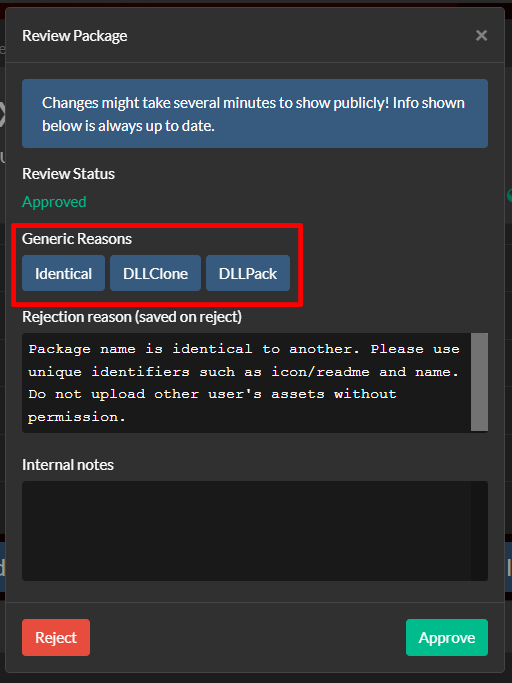

# LCThunderTools
A dumpsterfire of a chrome extension Boxofbiscuits97 built to help ease moderation of the LC Thunderstore page

> [!CAUTION]
> This is my first chrome extension and deep use of javascript, so it may act funky please ping on discord @boxofbiscuits97

## Features

### Upload Time
See what time files were uploaded

### Generic Reasons
An expanding list of what generic reasons to be autofilled by a click of a button

## Installation

1. Download and extract the zip file
2. Go to the [Chrome Etensions Page](chrome://extensions/)
3. Make sure Developer mode is enabled
4. Click `Load unpacked` and select the `extension` folder from the zip 